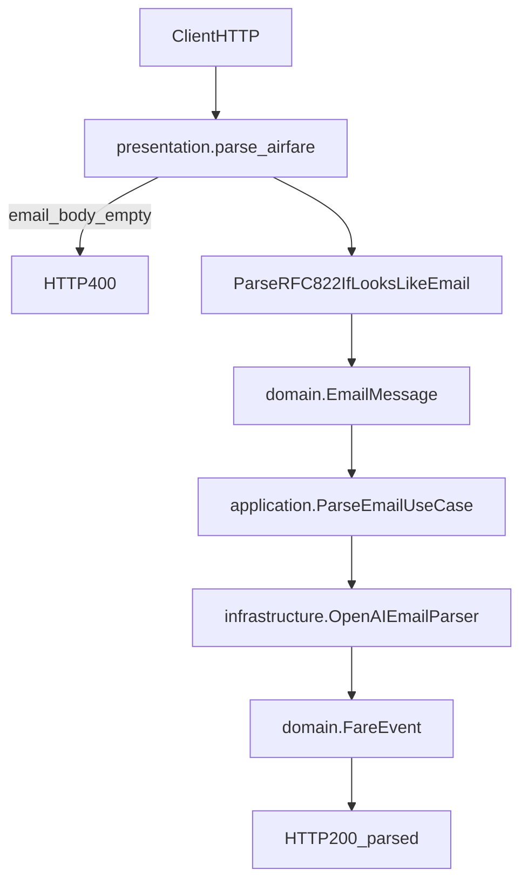
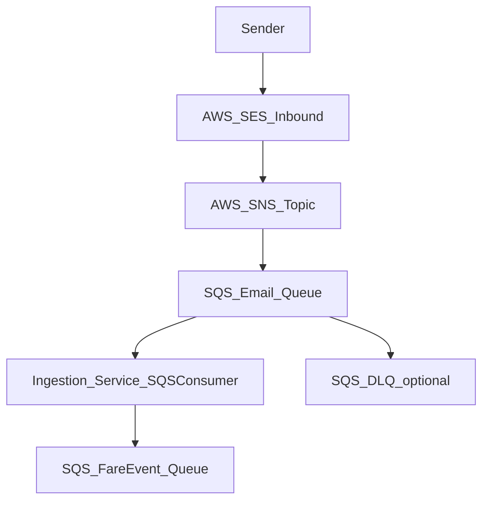

## Ingestion (FairFare) — Microservice d’ingestion emails → `FareEvent`

Ce microservice est l’équivalent fonctionnel de `ff-ingestion`, implémenté selon **Clean Architecture** (avec un Domain Model pragmatique).

Son rôle est de:
- **Recevoir des emails** (via API HTTP ou via SQS depuis un pipeline SES → SNS → SQS)
- **Extraire** une demande de voyage (via OpenAI) et produire une extraction structurée
- **Normaliser** en un message `FareEvent`
- **Publier** le `FareEvent` sur une queue SQS downstream (uniquement dans le chemin consumer)

---

## 1) Arborescence du projet

```
Ingestion/
├─ src/
│  ├─ main.py                          # Entrée FastAPI + lifespan (start/stop consumer)
│  ├─ config.py                        # Settings (env/.env + Secrets Manager optionnel)
│  ├─ logger.py                        # Logger JSON (stdout)
│  ├─ xray_config.py                   # Shim compat (importe l’impl X-Ray Infra)
│  │
│  ├─ domain/                          # Couche Domain (métier pur)
│  │  ├─ entities/
│  │  │  ├─ email_message.py           # EmailMessage (entrée métier)
│  │  │  └─ fare_event.py              # FareEvent (message normalisé)
│  │  ├─ value_objects/
│  │  │  ├─ email_metadata.py          # EmailThreadMetadata (threading)
│  │  │  └─ travel_extract.py          # TravelExtract (VO extraction)
│  │  └─ enums/
│  │     └─ parsing_status.py          # ParsingStatus
│  │
│  ├─ application/                     # Couche Application (use-cases + interfaces)
│  │  ├─ interfaces/
│  │  │  ├─ email_parser.py            # IEmailParser (Protocol)
│  │  │  └─ message_publisher.py       # IMessagePublisher (Protocol)
│  │  ├─ use_cases/
│  │  │  ├─ parse_email_use_case.py    # ParseEmailUseCase (parse -> FareEvent)
│  │  │  └─ process_email_use_case.py  # ProcessEmailUseCase (parse + publish)
│  │  └─ services/
│  │     └─ ingestion_service.py       # IngestionService (facade composition)
│  │
│  ├─ infrastructure/                  # Détails techniques (AWS, OpenAI, SQS, X-Ray)
│  │  ├─ parsers/
│  │  │  └─ openai_email_parser.py     # OpenAIEmailParser (impl IEmailParser)
│  │  ├─ messaging/
│  │  │  ├─ sqs_consumer.py            # SQSConsumer (poll, unwrap SNS/SES, delete)
│  │  │  └─ sqs_publisher.py           # SQSPublisher (impl IMessagePublisher)
│  │  └─ aws/
│  │     ├─ secrets_manager.py         # Helpers Secrets Manager (optionnel)
│  │     └─ xray_config.py             # Impl X-Ray (segments/subsegments)
│  │
│  ├─ presentation/                    # Couche Presentation (FastAPI)
│  │  ├─ api/
│  │  │  ├─ dependencies.py            # DI simple (singletons + metrics)
│  │  │  ├─ metrics.py                 # Métriques Prometheus + compat
│  │  │  └─ ingestion_router.py        # Routes: / /health /metrics /parse
│  │  └─ schemas/
│  │     ├─ parse_request_schema.py
│  │     ├─ parse_response_schema.py
│  │     └─ health_response_schema.py
│  │
│  └─ shared/
│     ├─ constants.py                  # Version/nom service
│     ├─ exceptions.py                 # Exceptions métier/app
│     ├─ utils.py                      # Heuristique “email brut”
│     └─ email_utils.py                # Parse EML + extraction body texte
│
├─ tests/
│  ├─ conftest.py                      # Ajoute `src/` au PYTHONPATH (src-layout)
│  └─ unit/
│     ├─ application/...
│     ├─ domain/...
│     ├─ infrastructure/...
│     ├─ presentation/test_parse_endpoint.py
│     ├─ shared/test_email_utils.py
│     └─ test_health_endpoints.py
│
├─ .env.example                        # Template variables d’env (local)
├─ Dockerfile                          # Image production
├─ Dockerfile.dev                      # Image dev (hot reload)
├─ Makefile                            # Commandes dev (plutôt Linux)
├─ pyproject.toml                      # Dépendances + ruff/pytest config
├─ ARCHITECTURE.md                     # Flux et dépendances des couches
└─ DOCUMENTATION_REFERENCE.md          # Référence exhaustive (utilisé par / utilise / impact)
```

---

## 2) Fonctionnalités (ce que fait le microservice)

### 2.1 API HTTP (FastAPI)

Endpoints exposés:
- **`GET /`**: retourne les infos du service et le lien docs
- **`GET /health`**: **endpoint unique** (live + ready) + configuration + checks + métriques
- **`GET /metrics`**: métriques **Prometheus**
- **`POST /parse`**: parse un contenu email/texte

Contrat important (parité `ff-ingestion`):
- Une erreur de validation FastAPI/Pydantic est rendue en **HTTP 400** (pas 422).
- `POST /parse`:
  - **400** si `email_body` vide
  - **400** si le sender est introuvable (impossible de traiter correctement)
  - **500** pour le reste
  - Retour success: `{ "fare_event_id": "...", "status": "parsed" }`

### 2.2 Consumer SQS (optionnel)

Si `CONSUMER_ENABLED=true`, le microservice démarre un consumer qui:
- Long-poll une queue source `SQS_EMAIL_QUEUE_URL`
- Dépaquette SNS/SES, decode le `content` base64, récupère `sender/subject/threading`
- Traite via `ProcessEmailUseCase` (parse + validation non bloquante + publish)
- Publie le `FareEvent` vers `SQS_FARE_EVENT_QUEUE_URL` (avec support FIFO)
- Prolonge le visibility timeout pendant le traitement (heartbeat)
- Supprime le message source en batch (`delete_message_batch`)
- **Ne supprime pas** sur erreur transitoire (OpenAI/publish), laisse SQS redélivrer + DLQ

Performance:
- Les messages reçus dans un poll sont traités en parallèle, bornés par `SQS_MAX_CONCURRENT_MESSAGES`.

### 2.3 Notifications (queue dédiée → ff-notifier)

Le microservice publie des `NotificationEvent` riches sur une queue dédiée
(`SQS_NOTIFICATIONS_QUEUE_URL`) consommée par le microservice **ff-notifier**
qui se charge de l'envoi des emails.

Deux catégories d'événements :

- **`user_untreatable`** — quand la demande de l'utilisateur est intraitable
  (parse OpenAI échoué, poison message avec sender connu, hard fail Tier 1
  côté `ff-intelligence-engine`). Le payload contient un `missing_fields[]`
  exhaustif (label, expected, found, fix_hint) pour rédiger un email clair.
- **`support_alert`** — quand un problème serveur intervient (poison message,
  body vide, sender absent, OpenAI durablement indisponible, etc.). Le payload
  contient `error.{class,message,file,line,function,stack}` et un
  `source_artifact` (queue_url, sqs_message_id, ses_message_id, raw_body_excerpt)
  pour retrouver le payload concerné.

Garanties :

- **Idempotence** : `event_id` déterministe (uuid5) → dédup native côté notifier.
- **Throttle support** : 1 alerte / `SUPPORT_ALERT_THROTTLE_SECONDS` / code (défaut 300 s).
- **Best-effort** : `NotifyFailureUseCase` ne lève jamais — un échec de
  notification ne casse pas le pipeline d'ingestion.
- **Kill switch** : `NOTIFICATIONS_ENABLED=false` désactive intégralement la
  publication (utile en dev/test sans queue dédiée).

Contrat partagé (utilisé aussi par `ff-intelligence-engine`) :
voir [docs/NOTIFICATIONS_CONTRACT.md](docs/NOTIFICATIONS_CONTRACT.md).

Catalogue Tier 1 source de vérité (codes, paths, labels FR/EN, fix_hint) :
[src/domain/rules/tier1_catalog.py](src/domain/rules/tier1_catalog.py).

Métriques exposées (`GET /metrics`) :

- `ingestion_notification_publish_total{category,outcome}`
- `ingestion_notification_throttled_total{failure_code}`

---

## 2.3 Workflows “réellement importants” (runtime)

Cette section décrit **les workflows réels** qui font tourner le microservice en production/dev.

### Workflow A — Démarrage du service (lifespan)

Déclencheur:
- Uvicorn charge `main:app` (via `main.py`)

Étapes:
1) `src/main.py` exécute `init_xray()` (si activé via env)
2) FastAPI démarre et appelle `lifespan()`
3) Si `CONSUMER_ENABLED=true`, on instancie et démarre `SQSConsumer`
4) L’API reste disponible pendant que le consumer poll en arrière-plan
5) Au shutdown, FastAPI appelle `lifespan()` pour arrêter le consumer proprement

Fichiers impliqués:
- `src/main.py`
- `src/presentation/api/dependencies.py` (composition root)
- `src/infrastructure/messaging/sqs_consumer.py`

---

### Workflow B — API: `POST /parse` (parité `ff-ingestion`)

Déclencheur:
- un client appelle `POST /parse` avec:
  - `email_body` (obligatoire)
  - `sender` (optionnel)

Diagramme (simplifié):



Étapes détaillées:
1) Validation: si `email_body` vide → **400** `{ "error": "email_body cannot be empty" }`
2) Workflow “email brut RFC822”:
   - si le body ressemble à un email brut, on tente d’extraire:
     - `From` → `sender`
     - `Subject` → `subject`
     - `Message-ID`, `In-Reply-To`, `References`, `Reply-To` → threading metadata
3) Construction de `EmailMessage` (Domain)
4) Appel `ParseEmailUseCase.execute(email)` (Application)
5) Appel OpenAI via `OpenAIEmailParser.parse(email)` (Infrastructure)
6) Construction d’un `FareEvent` (Domain) + détermination du `ParsingStatus`
7) Réponse **200**: `{ "fare_event_id": "...", "status": "parsed" }`

Important (contrat/effets de bord):
- **Aucun publish SQS** dans ce workflow (conforme `ff-ingestion`).
- Les métriques in-memory sont incrémentées côté API (succès/erreurs).

Fichiers impliqués:
- `src/presentation/api/ingestion_router.py`
- `src/shared/email_utils.py`, `src/shared/utils.py`
- `src/application/use_cases/parse_email_use_case.py`
- `src/infrastructure/parsers/openai_email_parser.py`
- `src/domain/entities/fare_event.py`

Cas d’erreur importants:
- sender introuvable après extraction → **400** `{ "error": "Cannot extract sender email from message" }`
- erreur inattendue → **500** `{ "error": "Failed to parse airfare" }`

---

### Workflow C — Consumer SQS: pipeline SES → SNS → SQS → FareEvent

Déclencheur:
- `CONSUMER_ENABLED=true` au démarrage
- présence de messages sur `SQS_EMAIL_QUEUE_URL`

Diagramme (simplifié):

```mermaid
flowchart TD
  SES[SES] --> SNS[SNS]
  SNS --> SQSIn[SQS_EmailQueue]
  SQSIn --> Consumer[infrastructure.SQSConsumer]
  Consumer --> Unwrap[UnwrapSNS_SES_Base64]
  Unwrap --> EmailMsg[domain.EmailMessage]
  EmailMsg --> ProcessUC[application.ProcessEmailUseCase]
  ProcessUC --> ParseUC[application.ParseEmailUseCase]
  ParseUC --> OpenAIParser[infrastructure.OpenAIEmailParser]
  ProcessUC --> Publisher[infrastructure.SQSPublisher]
  Publisher --> SQSOut[SQS_FareEventQueue_(FIFO_optional)]
  Consumer --> Delete[DeleteSourceMessage]
```

Étapes détaillées:
1) Long polling `receive_message` (boto3) sur `SQS_EMAIL_QUEUE_URL`
2) Pour chaque message reçu:
   - Ouvre un segment X-Ray `ingestion_sqs_process_message` (si activé)
   - Parse le body JSON
   - Dépaquette:
     - wrapper SNS (`Message` est un JSON string)
     - notification SES (`mail` + `content`)
   - Decode `content` base64 → `email_body`
   - Récupère `sender`, `subject`, threading metadata (headers SES)
3) Construit `EmailMessage`
4) Appelle `ProcessEmailUseCase.execute`:
   - parse via `ParseEmailUseCase` (crée `FareEvent`)
   - validation schéma `FareEvent` (non bloquante)
   - **publish** via `SQSPublisher` sur `SQS_FARE_EVENT_QUEUE_URL`
5) Delete du message source (queue email) via **`delete_message_batch`**

Performance / robustesse:
- Les messages d’un même poll sont traités en parallèle (async) mais **bornés**
  par `SQS_MAX_CONCURRENT_MESSAGES` (sémaphore).
- `receive_message`, `change_message_visibility` (heartbeat) et delete batch tournent dans un threadpool (boto3 sync).
- En cas d’erreur “no sender”, le message est supprimé (parité `ff-ingestion`: impossible de répondre).
- En cas d’erreur transitoire (OpenAI/publish), le message **n’est pas supprimé** (redelivery SQS). Après `CONSUMER_MAX_RETRIES`, il est supprimé pour laisser la DLQ prendre le relais.

Fichiers impliqués:
- `src/infrastructure/messaging/sqs_consumer.py`
- `src/application/use_cases/process_email_use_case.py`
- `src/infrastructure/messaging/sqs_publisher.py`

---

### Workflow D — OpenAI (extraction + failure reasons)

Déclencheur:
- appel `OpenAIEmailParser.parse(email)`

Étapes:
1) Nettoie le body via `extract_email_body` (enlève headers/bruit multipart)
2) Appel OpenAI avec:
  - **`temperature=0` quand le modèle le supporte** (sinon on omet le paramètre)
  - `response_format={"type":"json_object"}` quand supporté (ou équivalent via l’API Responses)
3) Parse la réponse:
   - si JSON invalide → extraction `{}` + demande de “failure reasons”
4) Validation minimale:
   - si `origin` ou `destination` manquent → demande de “failure reasons”
5) Retour à l’Application: `(extracted_travel, response_id, failure_reasons?)`

Ce workflow est le plus coûteux (latence + coût OpenAI).

Fichiers impliqués:
- `src/infrastructure/parsers/openai_email_parser.py`
- `src/shared/email_utils.py`

---

### Workflow E — Observabilité: X-Ray + propagation de trace

Déclencheur:
- `ENABLE_XRAY=true`

Ce qui se passe:
- Un segment est ouvert au niveau message SQS
- Un subsegment est posé sur l’appel OpenAI (`parse_with_openai`)
- Le publisher propage `X-Amzn-Trace-Id` en `MessageAttributes` lors du publish SQS

Fichiers impliqués:
- `src/infrastructure/aws/xray_config.py` (impl)
- `src/xray_config.py` (shim)
- `src/infrastructure/messaging/sqs_publisher.py`

---

### Workflow F — Logs & métriques

- **Logs**:
  - JSON structuré sur stdout (prêt CloudWatch)
  - Fichier: `src/logger.py`
- **Métriques**:
  - Prometheus: exposées via `GET /metrics`
  - Health: inclut aussi les compteurs simples (compat)
  - Fichiers: `src/presentation/api/metrics.py` + `src/presentation/api/dependencies.py`

---

### Workflow G — Qualité (workflow dev)

Objectif:
- Vérifier la forme (ruff) et le comportement (pytest) avant merge/déploiement.

Commandes:
```bash
python -m ruff check src tests
python -m ruff format --check src tests
python -m pytest -q
```

Remarque:
- Le repo ne contient pas (encore) de `.github/workflows/` ici; la CI/CD peut être ajoutée
  à l’identique de `ff-ingestion` en réutilisant `FairFareHQ/ff-pipeline` si nécessaire.

---

## 3) Prérequis

- **Python 3.11+** recommandé (fonctionne aussi dans ton environnement actuel, mais vise 3.11 en CI/containers)
- Accès AWS si tu actives le consumer / Secrets Manager:
  - un profil AWS (`AWS_PROFILE`) ou des variables `AWS_ACCESS_KEY_ID` / `AWS_SECRET_ACCESS_KEY`
- (Optionnel) OpenAI:
  - `OPENAI_API_KEY` ou `SECRETS_MANAGER_ENABLED=true` + `OPENAI_SECRET_NAME`

---

## 4) Installation (local)

### 4.1 Créer un venv

#### Windows (PowerShell)

```powershell
python -m venv .venv
.\.venv\Scripts\Activate.ps1
python -m pip install --upgrade pip
```

#### Linux/macOS (bash)

```bash
python -m venv .venv
source .venv/bin/activate
python -m pip install --upgrade pip
```

### 4.2 Installer les dépendances

```bash
pip install -e ".[dev]"
```

---

## 5) Configuration (.env)

1) Copie le template:

```bash
cp .env.example .env
```

2) Renseigne au minimum:
- `AWS_REGION`
- `SQS_EMAIL_QUEUE_URL`
- `SQS_FARE_EVENT_QUEUE_URL`
- `SQS_NOTIFICATIONS_QUEUE_URL` (queue dédiée → ff-notifier)

3) Pour OpenAI (au choix):
- **Dev simple**: `SECRETS_MANAGER_ENABLED=false` + `OPENAI_API_KEY=...`
- **Prod-like**: `SECRETS_MANAGER_ENABLED=true` + `OPENAI_SECRET_NAME=...`

4) Pour activer/désactiver le consumer:
- `CONSUMER_ENABLED=true|false`

5) Pour les notifications (queue dédiée):
- `NOTIFICATIONS_ENABLED=true|false` (kill switch)
- `SUPPORT_ALERT_THROTTLE_SECONDS=300` (anti-spam, par failure_code)
- `SUPPORT_RUNBOOK_BASE_URL=...` (optionnel, ajoute `runbook_url` aux events)
- `SUPPORT_CONTACT_EMAIL=...` (exposé dans les templates user_untreatable)

Paramètres importants (recommandés):
- **Retry / DLQ**: `CONSUMER_MAX_RETRIES=3`
- **Heartbeat**: `SQS_HEARTBEAT_INTERVAL_SECONDS=60`, `SQS_HEARTBEAT_EXTEND_SECONDS=120`
- **OpenAI**: `OPENAI_TIMEOUT_SECONDS=20`, `OPENAI_MAX_RETRIES=2`
- **Logs OpenAI (PII)**: `LOG_OPENAI_PAYLOAD=false` (mettre `true` uniquement en dev)

---

## 6) Démarrage

### 6.1 Windows / PowerShell (recommandé)

> Important: `src/` doit être dans l’`app-dir` pour que les imports top-level (`config`, `main`, etc.) fonctionnent.

```powershell
$env:ENVIRONMENT='dev'
python -m uvicorn main:app --app-dir src --host 0.0.0.0 --port 8000 --reload
```

### 6.2 Linux/macOS

```bash
ENVIRONMENT=dev uvicorn main:app --app-dir src --host 0.0.0.0 --port 8000 --reload
```

### 6.3 Docker (dev)

```bash
docker build -f Dockerfile.dev -t ingestion:dev .
docker run --rm -p 8000:8000 --env-file .env ingestion:dev
```

---

## 7) Vérifications après démarrage

- Health:
  - `http://127.0.0.1:8000/health`
- Swagger:
  - `http://127.0.0.1:8000/docs`
- Metrics (Prometheus):
  - `http://127.0.0.1:8000/metrics`

Exemple de check rapide (Python):

```bash
python -c "import urllib.request; print(urllib.request.urlopen('http://127.0.0.1:8000/health').read().decode())"
```

---

## 8) Utilisation

### 8.1 Exemple `POST /parse`

```bash
curl -X POST "http://127.0.0.1:8000/parse" ^
  -H "Content-Type: application/json" ^
  -d "{\"email_body\":\"Flight from Paris to New York next Monday\",\"sender\":\"alice@example.com\"}"
```

### 8.2 Exemples `GET /health` et `GET /metrics`

Health:

```bash
python -c "import urllib.request; print(urllib.request.urlopen('http://127.0.0.1:8000/health').read().decode())"
```

Metrics (Prometheus):

```bash
python -c "import urllib.request; print(urllib.request.urlopen('http://127.0.0.1:8000/metrics').read().decode()[:400])"
```

---

## 9) Commandes dev (qualité)

### 9.1 Lint / format

```bash
python -m ruff check src tests
python -m ruff format src tests
```

### 9.2 Tests

```bash
python -m pytest -q
```

---

## 10) Troubleshooting

### 10.1 `make dev` échoue sous Windows

Le Makefile utilise une syntaxe d’export Linux (`ENVIRONMENT=dev ...`). Utilise la commande PowerShell du §6.1.

### 10.2 `ModuleNotFoundError: config` / `ModuleNotFoundError: main`

Lance uvicorn avec `--app-dir src`:

```powershell
python -m uvicorn main:app --app-dir src --reload
```

### 10.3 `/health` indique `openai_configured=false`

Le service peut démarrer sans OpenAI (mode dégradé), mais il ne pourra pas extraire correctement. Configure:
- `OPENAI_API_KEY` (ou Secrets Manager)

### 10.4 `TokenRetrievalError: token has expired` (AWS SSO)

Symptôme (dans les logs du consumer SQS):
- `botocore.exceptions.TokenRetrievalError: Error when retrieving token from sso: Token has expired and refresh failed`

Cause:
- Tu utilises un profil AWS SSO (`AWS_PROFILE=...`) et le token SSO local a expiré.

Solution (recommandée):

```powershell
aws sso login --profile <ton_profil_sso>
```

Ensuite, relance le service (ou attends le prochain poll SQS).

Alternatives:
- **Désactiver le consumer** (si tu veux juste tester l’API `/parse` en local):

```powershell
$env:CONSUMER_ENABLED="false"
python -m uvicorn main:app --app-dir src --reload
```

- **Utiliser des credentials statiques** (déconseillé sauf dev local temporaire):
  - définis `AWS_ACCESS_KEY_ID`, `AWS_SECRET_ACCESS_KEY` (et `AWS_SESSION_TOKEN` si nécessaire)
  - laisse `AWS_PROFILE` vide
- **Utiliser un rôle IAM (prod)**:
  - sur ECS/EKS/EC2, préfère les rôles IAM (task role / IRSA) et n’utilise pas SSO
  - laisse `AWS_PROFILE` vide dans l’environnement runtime
- **Reconfigurer SSO** si le profil est cassé:

```powershell
aws configure sso --profile <ton_profil_sso>
aws sso login --profile <ton_profil_sso>
```

---

## 11) Pour aller plus loin

- **Flux & couches**: `ARCHITECTURE.md`
- **Référence exhaustive (fichier/fonction/impact/dépendances)**: `DOCUMENTATION_REFERENCE.md`

---

## 12) Intégration AWS (SES → SNS → SQS) + configuration (pas-à-pas)

Cette section décrit **comment brancher Ingestion sur AWS** pour traiter de vrais emails.

### 12.1 Architecture cible



### 12.2 Pré-requis AWS (à créer/configurer)

- **SES inbound**:
  - Domaine/identité vérifié(e)
  - (Recommandé) rule set dédié “ingestion”
  - Action: publier sur SNS
- **SNS topic** (ex: `fairfare-email-ingestion-topic`)
  - Abonnement vers la queue SQS source
- **SQS queue source** (email) + (recommandé) **DLQ**
  - `VisibilityTimeout` >= temps max de traitement
  - `redrivePolicy` activée (maxReceiveCount en cohérence avec `CONSUMER_MAX_RETRIES`)
- **SQS queue downstream** (fare events)
  - Standard ou FIFO (`.fifo`) supporté
  - Si FIFO: `PARSED_SQS_MESSAGE_GROUP_ID` doit être défini

### 12.3 IAM (permissions minimales)

Le rôle (ECS task role / IAM user dev) doit permettre:
- Sur **queue source**:
  - `sqs:ReceiveMessage`
  - `sqs:DeleteMessage`
  - `sqs:DeleteMessageBatch`
  - `sqs:ChangeMessageVisibility`
  - `sqs:GetQueueAttributes` (optionnel mais utile)
- Sur **queue downstream**:
  - `sqs:SendMessage`
- Sur **Secrets Manager** (si activé):
  - `secretsmanager:GetSecretValue` sur `OPENAI_SECRET_NAME`
- Sur **X-Ray** (si activé):
  - `xray:PutTraceSegments`, `xray:PutTelemetryRecords`

### 12.4 Variables d’environnement à renseigner

Dans `.env` (local) ou via ECS/EKS/CI:
- **AWS**: `AWS_REGION`, `AWS_PROFILE` (local) ou credentials/role IAM
- **SQS**:
  - `SQS_EMAIL_QUEUE_URL`
  - `SQS_FARE_EVENT_QUEUE_URL`
  - `SQS_VISIBILITY_TIMEOUT`, `SQS_MAX_CONCURRENT_MESSAGES` (optionnel)
  - `SQS_HEARTBEAT_INTERVAL_SECONDS`, `SQS_HEARTBEAT_EXTEND_SECONDS` (recommandé)
- **Consumer**: `CONSUMER_ENABLED=true`, `CONSUMER_MAX_RETRIES=3`
- **OpenAI**:
  - direct: `OPENAI_API_KEY=...`
  - via Secrets Manager: `SECRETS_MANAGER_ENABLED=true`, `OPENAI_SECRET_NAME=...`
- **X-Ray** (optionnel): `ENABLE_XRAY=true`, `AWS_XRAY_DAEMON_ADDRESS=...`

### 12.5 Conseils prod (workflow “parfait”)

- **DLQ obligatoire** côté queue source (pour poison messages).
- **Idempotence**:
  - `FareEvent.id` est déterministe si `Message-ID` est présent → redelivery SQS n’engendre pas de doublons si downstream déduplique (et FIFO via `MessageDeduplicationId`).\n- **Time budgets**:
  - si OpenAI peut être lent, augmente `SQS_VISIBILITY_TIMEOUT` et/ou ajuste heartbeat.
- **Observabilité**:
  - `/metrics` pour Prometheus
  - activer X-Ray en prod si tu veux une trace bout-en-bout.

